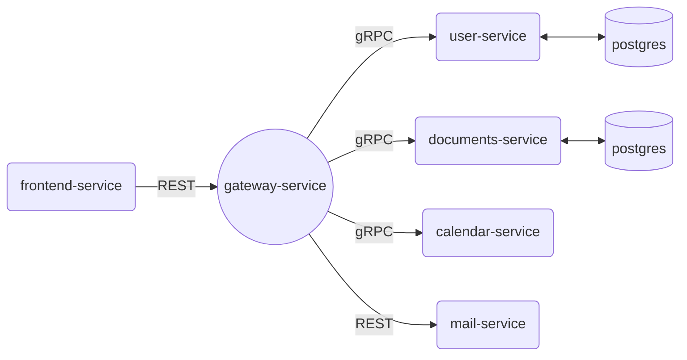

# validity.red

## Services

```mermaid
graph LR
    A(frontend-service) --> |REST| B((gateway-service))
    B -->|gRPC| C(user-service) <--> F[(postgres)]
    B -->|gRPC| D(documents-service) <--> G[(postgres)]
    B -->|gRPC| E(calendar-service)
    B -->|REST| H(mail-service)
```
