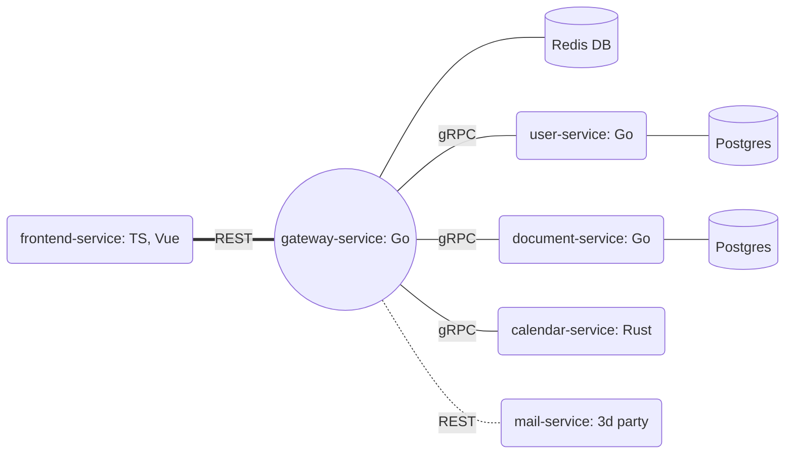

# validity.red

## Services

```mermaid
graph LR
    A(frontend-service: TS, Vue) === |REST| B((gateway-service: Go))
    B --- J[(Redis DB)]
    B --- |gRPC| C(user-service: Go) --- F[(Postgres)]
    B --- |gRPC| D(document-service: Go) --- G[(Postgres)]
    B --- |gRPC| E(calendar-service: Rust)
    B -.- |REST| H(mail-service: 3d party)
    click A "https://github.com/samgozman/validity.red/tree/main/frontend-service" "Frontend SPA written in VueJS and TypeScript"
    click B "https://github.com/samgozman/validity.red/tree/main/gateway-service" "Gateway service written in Go"
    click C "https://github.com/samgozman/validity.red/tree/main/user-service" "Users service written in Go"
    click D "https://github.com/samgozman/validity.red/tree/main/document-service" "Documents service written in Go"
    click E "https://github.com/samgozman/validity.red/tree/main/calendar-service" "Calendar service written in Rust"
```
