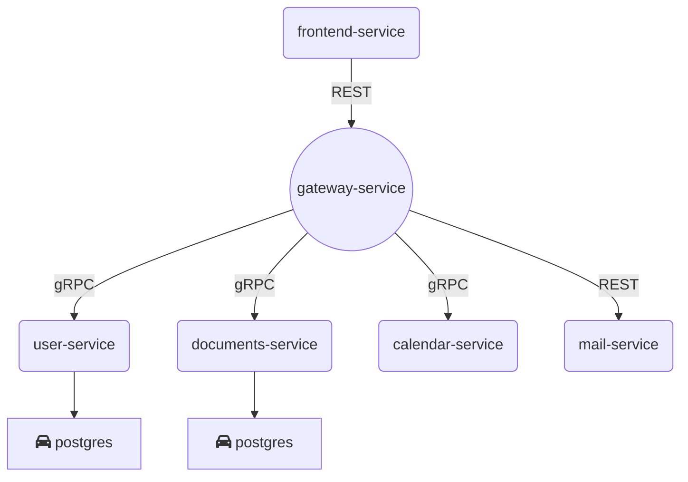

# validity.red

## Services

```mermaid
graph TD
    A(frontend-service) -->|REST| B((gateway-service))
    B -->|gRPC| C(user-service) --> F[fa:fa-car postgres]
    B -->|gRPC| D(documents-service) --> G[fa:fa-car postgres]
    B -->|gRPC| E(calendar-service)
    B -->|REST| H(mail-service)
```
