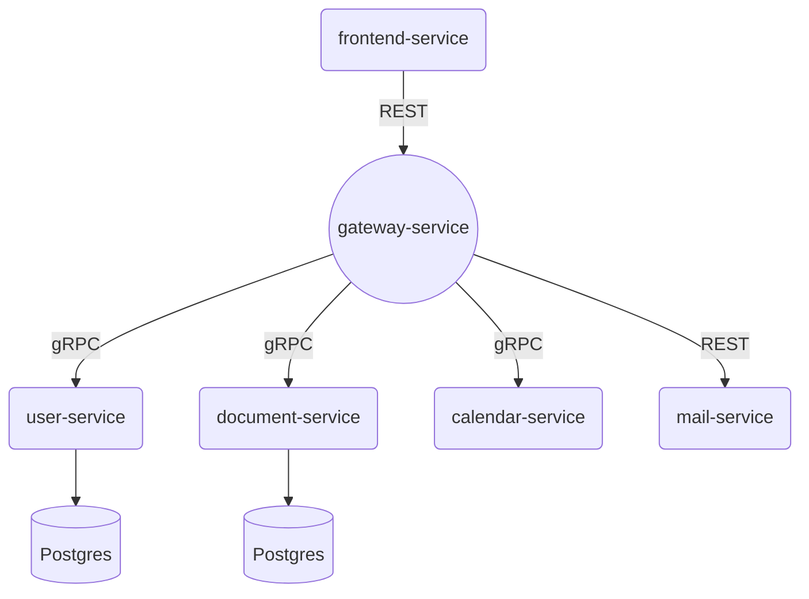

# validity.red

## Services

```mermaid
graph TB
    A(frontend-service) --> |REST| B((gateway-service))
    B -->|gRPC| C(user-service) --> F[(Postgres)]
    B -->|gRPC| D(document-service) --> G[(Postgres)]
    B -->|gRPC| E(calendar-service)
    B -->|REST| H(mail-service)
    click A "https://github.com/samgozman/validity.red/tree/main/frontend-service" "Frontend SPA written in VueJS and TypeScript"
    click B "https://github.com/samgozman/validity.red/tree/main/gateway-service" "Gateway service written in Go"
    click C "https://github.com/samgozman/validity.red/tree/main/user-service" "Users service written in Go"
    click D "https://github.com/samgozman/validity.red/tree/main/document-service" "Documents service written in Go"
    click E "https://github.com/samgozman/validity.red/tree/main/calendar-service" "Calendar service written in Rust"
```
