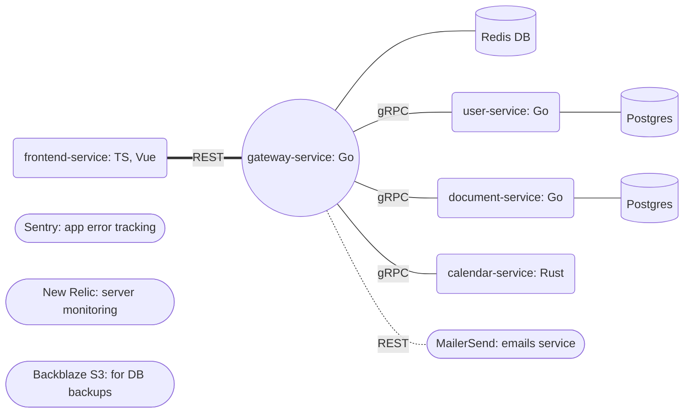

# Validity.Red

[](https://github.com/samgozman/validity.red/actions/workflows/unit_test.yml)

[](https://sonarcloud.io/summary/new_code?id=samgozman_validity.red)
[](https://www.codacy.com/gh/samgozman/validity.red/dashboard?utm_source=github.com&amp;utm_medium=referral&amp;utm_content=samgozman/validity.red&amp;utm_campaign=Badge_Grade)

[Validity.Red](https://validity.red) is a free web service for managing the expiration dates of documents (passports, travel cards, vaccinations, insurance, etc) and synchronizing them with your calendar. It is written in Go, TypeScript, Vue, and Rust.

## Main features

* Create documents with expiration dates and notifications
* Manage your documents, categories them, and add notes
* Create multiple notifications for each document
* Sync your notifications with your calendar app (Google Calendar, Apple Calendar, Outlook, etc.)

More features are coming soon! The project is in active development.

## Services architecture



## Quick start into development

To run the Validity.Red app locally, you will need to have the following dependencies installed on your system:

* Docker
* Docker Compose
* Go
* Rust
* GolangCI-Lint
* rustfmt
* protoc
* Cargo
* Node.js v18

Download all the GO service dependencies:

```sh
make download_go_deps
```

Download and build all Rust dependencies:

```sh
make build_rust
```

Download all NPM dependencies:

```sh
make download_npm_deps
```

After that you can simply run the following command to run backend applications:

```sh
make up_build
```

and then to start up SPA dev server:

```sh
make spa_run_dev
```

And thats it! For more information please read the documentation provided in each services folder.

### Production environment

Validity.Red deployment and automation relies on GitHub CI and Terraform. You can find out more in the [deployment section](https://github.com/samgozman/validity.red/tree/main/deploy).

### Contribution

If you would like to contribute to the development of Validity.Red, please fork the repository and submit a pull request with your changes. We welcome any contributions that improve the service. You can also view the current project board [here](https://github.com/users/samgozman/projects/2).

You can also contribute by reporting bugs or suggesting new features. Please use the [GitHub issues](https://github.com/samgozman/validity.red/issues) for that.

### ❤️ Support the project

This project is 100% open-source and is available for free. If you like it - you can support Validity.Red financially. Please look at [FUNDING.yml](https://github.com/samgozman/validity.red/blob/main/.github/FUNDING.yml) page.

### License

Validity.Red is licensed under the MIT License.
