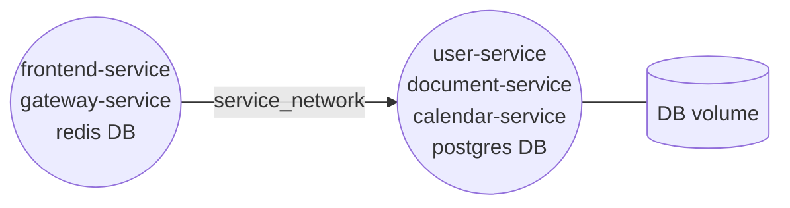

# Deploy instructions

## Current deployment scheme

In the current deployment setup there are only 2 servers used with one mounted volume for the database:

1. Public server - frontend-service, gateway-service, Redis DB
2. Private server - user-service, document-service, calendar-service, Postgres DB

The idea is that only the public server is exposed to the internet. The private server with DB is only accessible from the public server.

## Preferred server configuration

The lowest cost option is to use a single server for all services. This is the easiest to setup and maintain. The main downside is that the server data will be more vulnerable. Besides, only the DB server will need backups and persistent storage.

1. Public server: Ubuntu 22.04, 2 VCPU, 2 GB RAM, 20 GB SSD, IPv4, 1+ TB traffic
2. Private server: Ubuntu 22.04, 2 VCPU, 2 GB RAM, 20 GB SSD
3. Volume: 10 GB, persistent

## Create servers with Terraform

1. Create `secrets.auto.tfvars` file in 'deploy' directory with the following content: `hcloud_token = "YOUR_HETZNER_TOKEN"`
2. Create SSH keys for the servers: `id_rsa` and `validityred_github`
3. Run `terraform init` and then `terraform apply` in 'deploy' directory
4. Edit name of the mounted volume in `services/docker-compose.yml` file. Unfortunately, hcloud does not support mounting volumes by name, so the name of the volume in the file system is generated from it's id. It can be changed later, but it's easier to leave it as it is. Today it's **HC_Volume_`${volume_id}`**.

## Deploy services

Will be handled by CI/CD pipeline in GitHub Actions. But you can do it manually - just don't forget to set
environment variables in the 'deploy' directory (as described in the `.sample` files).

To-do list for github deployment:

- Create ENV variables in github Secrets section (see .sample files in deploy directory)
- Create env `SENTRY_AUTH_TOKEN` for Sentry plugin for SPA
- Run publish.yml workflow to create docker images
- Run deploy_services.yml workflow to deploy services
- Run deploy_spa.yml to build and deploy SPA

## Add monitoring configuration

For monitoring, I use NewRelic and Sentry. Sentry integration is already configured in the services,
you just need to provide DSN to get it work. As for the NewRelic, you need to install the agent on the server by official instructions.
