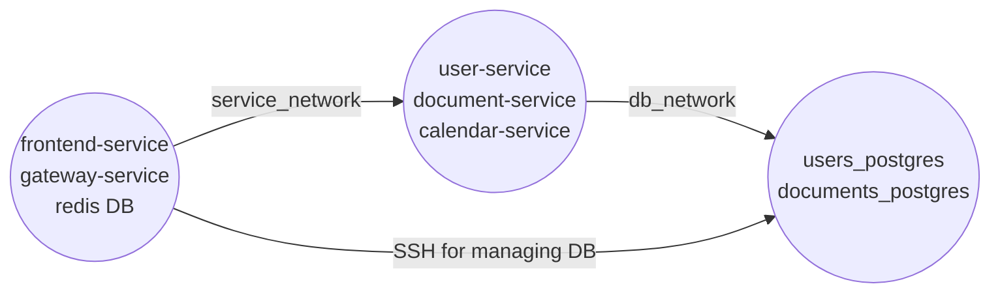

# Deploy instructions

## Current deployment scheme

In the current deployment setup there are only 3 servers used:

1. Public server - frontend-service, gateway-service, Redis DB
2. Private server - user-service, document-service, calendar-service
3. DB server - users_postgres, documents_postgres (database server)

The idea is that only the public server is exposed to the internet. The private server is only accessible from the public server and the Postgres DB server is only accessible from the private server.

But for the sake of more simple way of managing Postgres DB, the Public server also has SSH access to the DB server. This is not a bets practice, but it is a temporary solution for the time that the project is using self-managed Postgres DB.

In any case, the Postgres DB server is not exposed to the internet. It is only accessible from the private network.

## Preferred server configuration

Lowest cost option is to use a single server for all services. This is the easiest to setup and maintain. The main downside is that the server data will be more vulnerable. Besides, only DB server will need backups and persistent storage.

1. Public server: Ubuntu 22.04, 2 VCPU, 2 GB RAM, 20 GB SSD, IPv4, 1+ TB traffic
2. Private server: Ubuntu 22.04, 2 VCPU, 2 GB RAM, 20 GB SSD
3. DB server: Ubuntu 22.04, 2 VCPU, 2 GB RAM, 20 GB SSD, backups, persistent storage

## Create servers with Terraform

1. Create `secrets.auto.tfvars` file in 'deploy' directory with the following content: `hcloud_token = "YOUR_HETZNER_TOKEN"`
2. Create SSH keys for the servers: `id_rsa` and `validityred_github`
3. Run `terraform init` and then `terraform apply` in 'deploy' directory

## Deploy services

Will be handled by CI/CD pipeline in GitHub Actions. But you can do it manually - just don't forget to set
environment variables in 'deploy' directory (as described in the `.sample` files).

To-do list for github deployment:

- Create ENV variables in github Secrets section
- Run publish.yml workflow to create docker images
- Run deploy_services.yml workflow to deploy services
- Run deploy_spa.yml to build and deploy SPA
